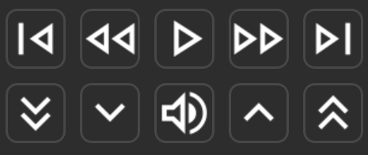
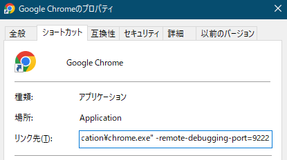

## Youtube Controller
Stream Deckを使ってGoogle Chromeで再生されているYoutubeをコントロールできます。


### Setup
1. ファイルをダウンロードしてStream Deckにインストールします。[Download](https://github.com/ursa-ac/StreamDeck-YoutubeController/releases/)
2. Google Chromeのショートカットのプロパティーを開き、`リンク先`に追加します。
```console
 -remote-debugging-port=9222
```
3. Google Chromeを再起動します。<br>


